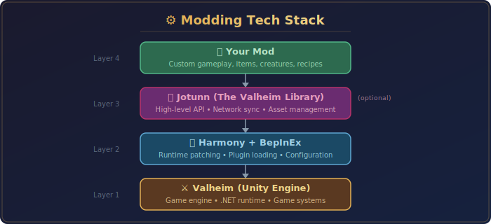

  

  
  
  
  
  

  <i>A comprehensive resource hub for Valheim mod development — mods, documentation, guides, and community resources</i>

## 🎯 Overview

This repository serves as a central hub for:
- **Actual Valheim mods** created and maintained in the `mods/` directory
- **Comprehensive documentation** on Valheim modding frameworks and tools
- **Best practices** for mod development
- **Code examples** and templates
- **Development guides** for both beginners and experienced modders
- **Community resources** and references

## 🚀 Quick Start

### For Users (Installing Mods)
1. Install [BepInEx](https://thunderstore.io/c/valheim/p/denikson/BepInExPack_Valheim/) via Thunderstore Mod Manager or manually
2. Download mods from [Thunderstore](https://valheim.thunderstore.io/) or [Nexus Mods](https://www.nexusmods.com/valheim)
3. Place mod `.dll` files in `BepInEx/plugins/` folder
4. Launch Valheim

### For Developers (Creating Mods)
1. Set up your development environment (see [Development Setup Guide](docs/DEVELOPMENT_SETUP.md))
2. Use the [JotunnModStub](https://github.com/Valheim-Modding/JotunnModStub) template
3. Follow our [Best Practices Guide](docs/BEST_PRACTICES.md)
4. Check out [Code Examples](docs/EXAMPLES.md)

## 📦 Mods

All mods created for this repository are located in the **[mods/](mods/)** directory. Each mod has its own subfolder with:
- Source code
- Documentation
- Build configuration
- Distribution files

See the [mods README](mods/README.md) for structure guidelines and how to build/test mods.

## 📚 Documentation

| Resource | Description |
|:---------|:------------|
| 📖 **[Framework Overview](docs/FRAMEWORKS.md)** | BepInEx and Jotunn explained |
| 🛠️ **[Development Setup](docs/DEVELOPMENT_SETUP.md)** | Setting up your mod development environment |
| ✅ **[Best Practices](docs/BEST_PRACTICES.md)** | Guidelines for writing maintainable mods |
| 🔗 **[Harmony Patching Guide](docs/HARMONY_GUIDE.md)** | Learn runtime code patching |
| 💻 **[Code Examples](docs/EXAMPLES.md)** | Sample code and templates |
| 🌐 **[Community Resources](docs/RESOURCES.md)** | Links to helpful repositories and communities |

## 🔧 Key Technologies

  

| Technology | Role | Links |
|:-----------|:-----|:------|
| **BepInEx** | Foundational mod loader for Unity games | [Docs](https://docs.bepinex.dev/) · [GitHub](https://github.com/BepInEx/BepInEx) |
| **Jotunn (Jötunn)** | The Valheim Library — utility functions and helpers | [Docs](https://valheim-modding.github.io/Jotunn/) · [GitHub](https://github.com/Valheim-Modding/Jotunn) |
| **Harmony** | Runtime method patching for C# | [Docs](https://harmony.pardeike.net/) · [GitHub](https://github.com/pardeike/Harmony) |
| **Unity** | The game engine Valheim is built on | [Docs](https://docs.unity3d.com/ScriptReference/) |

## 🌟 Popular Community Repositories

| Repository | Description |
|:-----------|:------------|
| ⭐ [Jotunn Library](https://github.com/Valheim-Modding/Jotunn) | The official Valheim modding library |
| 📋 [JotunnModStub](https://github.com/Valheim-Modding/JotunnModStub) | Official mod template |
| 📖 [JotunnModExample](https://github.com/Valheim-Modding/JotunnModExample) | Comprehensive examples |
| 🧰 [ModTemplateValheim](https://github.com/Measurity/ModTemplateValheim) | Alternative template |

## 🤝 Contributing

Contributions are welcome! Whether it's:
- Improving documentation
- Adding code examples
- Sharing best practices
- Reporting issues

## 📝 License

This repository is for educational purposes. Individual mods and their licenses may vary.

## 🔗 Useful Links

  
  
  
  
  

---

  <b>⚠️ Always backup your game saves before installing mods!</b>

  Made with ⚔️ for the Valheim modding community

